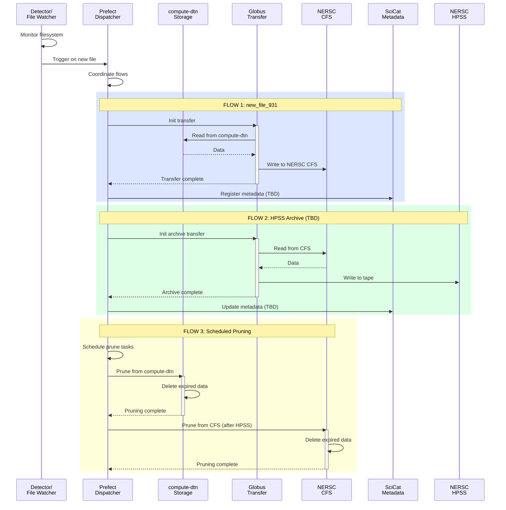

# Beamline 9.3.1 Flows

This page documents the workflows supported by Splash Flows at [ALS Beamline 9.3.1 (Tender X-ray Spectroscopy)](https://als.lbl.gov/beamlines/9-3-1/).

## Data at 9.3.1

Generates spectroscopy data.

## File Watcher

There is a file watcher on the acquisition system that listens for new scans that have finished writing to disk. From there, a Prefect Flow we call `dispatcher` kicks off the downstream steps:
- Copy scans in real time from a Globus collection on the `compute-dtn` server to `NERSC CFS` using Globus Transfer.
- Copy project data to `NERSC HPSS` for long-term storage (TBD).
- Analysis on HPC systems (TBD).
- Ingest into SciCat (TBD).
- Schedule data pruning from `compute-dtn` and `NERSC CFS`.

## Prefect Configuration

### Registered Flows

#### `dispatcher.py`

The Dispatcher Prefect Flow manages the logic for handling the order and execution of data tasks. Once a new file is written, the `dispatcher()` Flow is called. In this case, the dispatcher handles the synchronous call to `move.py`, with a potential to add additional steps (e.g. scheduling remote HPC analysis code).

#### `move.py`

Flow to process a new file at BL 9.3.1
1. Copy the file from `compute-dtn` to `NERSC CFS` and ingest the file path and metadata into SciCat.
2. Schedule pruning from `compute-dtn`.
3. Copy the file from `NERSC CFS` to `NERSC HPSS`. Ingest the archived file path in SciCat.
4. Schedule pruning from `NERSC CFS`.

## VM Details

The computing backend runs on a VM in the B15 server room that is managed by ALS IT staff.

`flow-931.als.lbl.gov`

## Flow Diagram

