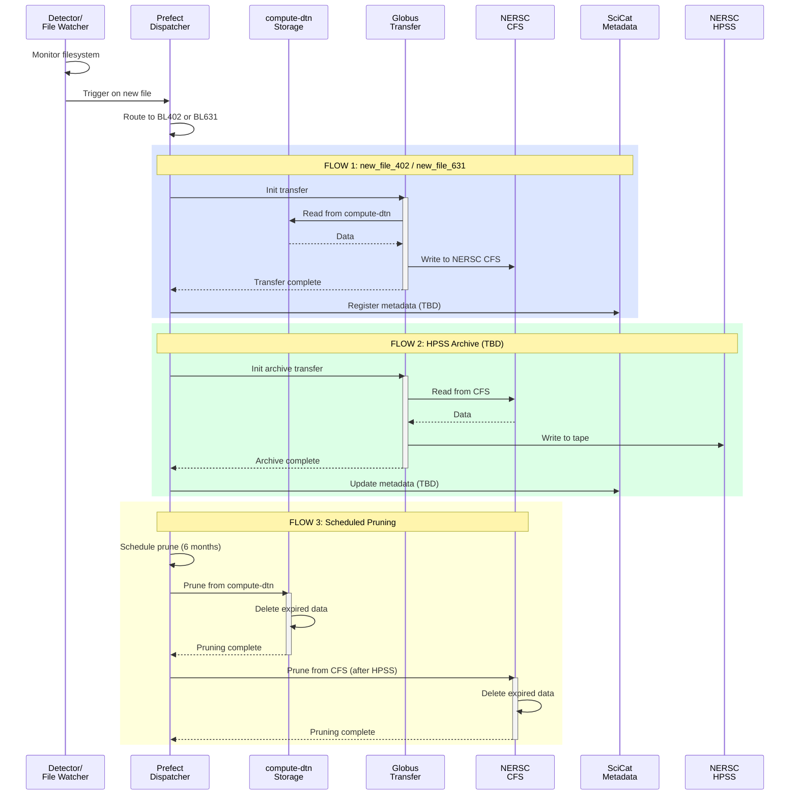

# Dichroism Beamline Flows
This page documents the workflows supported by Splash Flows for the ALS Dichroism beamlines:

- [Beamline 4.0.2](https://als.lbl.gov/beamlines/4-0-2/)
- [Beamline 6.3.1](https://als.lbl.gov/beamlines/6-3-1/)

## File Watcher
There is a file watcher on the acquisition system that listens for new scans that have finished writing to disk. From there, a Prefect Flow we call `dispatcher` kicks off the downstream steps:

- Copy scans in real time from a Globus collection on the compute-dtn server to `NERSC CFS` using Globus Transfer.
- Copy project data to `NERSC HPSS` for long-term storage (TBD).
- Ingest into SciCat (TBD).
- Schedule data pruning from `compute-dtn` and `NERSC CFS`.

## Prefect Configuration

### Registered Flows
#### [dispatcher.py](orchestration/flows/dichroism/dispatcher.py)
The Dispatcher Prefect Flow manages the logic for handling the order and execution of data tasks. Once a new file is written, the `dispatcher()` Flow is called with either `BL402` or `BL631` as a parameter to specify the beamline. The dispatcher handles the synchronous call to the appropriate move task.

#### [move.py](orchestration/flows/dichroism/move.py)
Contains separate move tasks/flows for each beamline:

- `process_new_402_file`: Flow to process a new file at BL 4.0.2
- `process_new_631_file`: Flow to process a new file at BL 6.3.1

Each flow performs the following steps:

- Copy the file from `compute-dtn` to `NERSC CFS` and ingest the file path and metadata into SciCat.
- Schedule pruning from `compute-dtn`.
- Copy the file from `NERSC CFS` to `NERSC HPSS`. Ingest the archived file path in SciCat.
- Schedule pruning from `NERSC CFS` (after archiving).

### Work Pools and Queues
The following work pools are defined in `orchestration/flows/dichroism/prefect.yaml`:

| Deployment | Work Pool | Work Queue |
|------------|-----------|------------|
| `run_dichroism_dispatcher` | `dispatcher_dichroism_pool` | `dispatcher_402_queue` / `dispatcher_631_queue` |
| `new_file_402` | `new_file_dichroism_pool` | `new_file_402_queue` |
| `new_file_631` | `new_file_dichroism_pool` | `new_file_631_queue` |
| `test_transfers_dichroism` | `new_file_dichroism_pool` | `test_transfers_dichroism_queue` |

Both beamlines share the same work pools but use separate queues for fine-grained control.

### Endpoint Configuration
**Globus Endpoints**
Endpoints are defined in config.yml:
```yaml
bl402-compute-dtn:
    root_path: /
    uri: compute-dtn.als.lbl.gov
    uuid: <UUID>
    name: bl402-compute-dtn

bl402-nersc_alsdev_raw:
    root_path: /global/cfs/cdirs/als/data_mover/4.0.2/raw
    uri: nersc.gov
    uuid: <UUID>
    name: bl402-nersc_alsdev_raw

bl631-compute-dtn:
    root_path: /
    uri: compute-dtn.als.lbl.gov
    uuid: <UUID>
    name: bl631-compute-dtn

bl631-nersc_alsdev_raw:
    root_path: /global/cfs/cdirs/als/data_mover/6.3.1/raw
    uri: nersc.gov
    uuid: <UUID>
    name: bl631-nersc_alsdev_raw
```

#### Deployment
**Register Flows**
Using the init script with Docker:
```bash
BEAMLINE=dichroism ./init_work_pools.py
```
Or deploy manually:
```bash
prefect deploy --prefect-file orchestration/flows/dichroism/prefect.yaml --all
```
Start Workers

```bash
prefect worker start --pool "dispatcher_dichroism_pool"
prefect worker start --pool "new_file_dichroism_pool"
```

Deployment of the Prefect Server and Workers is handled in the [als_ansible](https://github.com/als-computing/als_ansible) repository.

#### VM Details
The computing backend runs on a VM managed by ALS IT staff.
flow-dichroism.als.lbl.gov

## Flow Diagram
